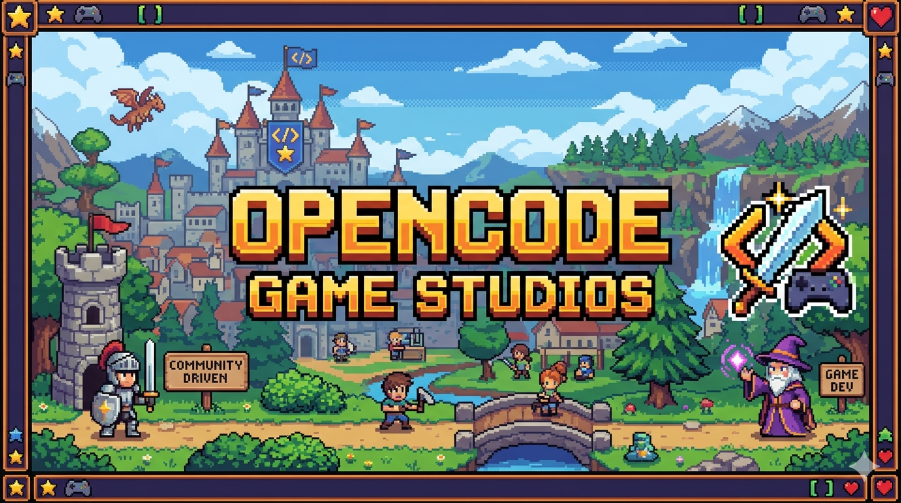

# OpenCode Game Studios

<p align="center">
  
</p>

> ⚡ Port of [Claude Code Game Studios (CCGS)](https://github.com/Donchitos/Claude-Code-Game-Studios) to [OpenCode](https://opencode.ai)

[](LICENSE)
[](.opencode/agents/)
[](.opencode/skills/)
[](.opencode/plugins/)
[](.opencode/plugins/tests/)
[](https://opencode.ai)

---

## 📑 Table of Contents

- [💡 Motivation](#-motivation)
- [📊 Port Status](#-port-status)
- [🚀 Quick Start](#-quick-start)
- [🔌 Recommended Plugins](#-recommended-plugins)
- [🗺️ Key Mappings](#️-key-mappings)
- [🧠 Model Mapping](#-model-mapping)
- [🎯 Model Assignment Strategy](#-model-assignment-strategy)
- [🔄 Customizing Models](#-customizing-models)
- [📁 Directory Tree](#-directory-tree)
- [🔗 Hooks Plugin](#-hooks-plugin)
- [🏗️ Studio Hierarchy](#️-studio-hierarchy)
- [🐛 Known Issues](#-known-issues)
- [📄 License](#-license)

---

## 💡 Motivation

Claude Code's strict session and usage limits make it impractical for large-scale,
long-running game development — sessions expire, context is frequently wiped, and
high usage quickly hits rate caps. **OpenCode** removes those constraints,
allowing sustained development over the full lifecycle of a game project. While there
are some workarounds for Claude Code to access other models through local proxies, 
this is not the intended use of Claude Code and such setups are fragile at best. 

This port adapts the complete [CCGS](https://github.com/Donchitos/Claude-Code-Game-Studios)
framework — its 49 agents, 73 skills, 12 hooks, and all rules — to run natively
on OpenCode, giving game teams the same structured AI-assisted workflow without
the artificial limits.

---

> ⚠️ **Early Prototype** — This is an active work-in-progress port. Things will
> break, change, and improve. Report bugs at
> [github.com/striderZA/OpenCodeGameStudios/issues](https://github.com/striderZA/OpenCodeGameStudios/issues).

---

## 📊 Port Status

| Component | CCGS (Claude Code) | OpenCode | Status |
|-----------|-------------------|----------|--------|
| 🤖 **Agents** | 49 agents (`.claude/agents/`) | 49 agents (`.opencode/agents/`) | ✅ |
| ⌨️ **Skills** | 72 skills (`.claude/skills/`) | 73 skills (`.opencode/skills/`) | ✅ +1 |
| 🔗 **Hooks** | 12 bash hooks (`.claude/hooks/`) | 1 TS plugin (`.opencode/plugins/`) | ✅ **129 tests** |
| 📏 **Rules** | 11 rule files (`.claude/rules/`) | 11 rule files (`.opencode/rules/`) | ✅ |
| ⚙️ **Config** | `CLAUDE.md` + `.claude/settings.json` | `AGENTS.md` + `opencode.json` | ✅ |

---

## 🚀 Quick Start

```bash
opencode
```

Type `/` to browse all 73 skills, or `/start` for onboarding.

---

## 🔌 Recommended Plugins

These plugins enhance the OpenCode experience and are recommended for
all game development sessions:

| Plugin | Purpose |
|--------|---------|
| [**dynamic-context-purging**](https://github.com/Opencode-DCP/opencode-dynamic-context-pruning)| Dynamic context pruning — automatically manages context window size, indexes content for search, and prevents context overflow during long sessions |
| [**Superpowers**](https://github.com/obra/superpowers) | Enhanced skill library — provides structured workflows for brainstorming, test-driven development, writing plans, code review, and parallel agent dispatch |

Add them to your `opencode.json`:

```json
{
  "plugin": [
    "./.opencode/plugins/ccgs-hooks.ts",
    "PLUGIN_NAME"
  ]
}
```

---

## 🗺️ Key Mappings

| CCGS (Claude Code) | OpenCode |
|--------------------|----------|
| `.claude/skills/*.md` → | `.opencode/skills/*.md` |
| `.claude/agents/*.md` → | `.opencode/agents/*.md` |
| `.claude/hooks/*.sh` → | `.opencode/plugins/ccgs-hooks.ts` |
| `.claude/rules/*.md` → | `.opencode/rules/*.md` |
| `CLAUDE.md` → | `AGENTS.md` |
| `.claude/settings.json` → | `opencode.json` |

---

## 🧠 Model Mapping

| CCGS | OpenCode |
|------|----------|
| `opus` 🐙 | `kimi-k2.6` |
| `sonnet` 🖋️ | `qwen3.6-plus` |
| `haiku` 🍃 | `deepseek-v4-flash` |

---

## 🎯 Model Assignment Strategy

| Tier | Model | Agents | Rationale |
|------|-------|--------|-----------|
| **Directors** (Tier 1) | `opencode-go/kimi-k2.6` | 3 (creative-director, technical-director, producer) | Heaviest model for strategic planning, architecture decisions, and cross-team coordination |
| **Workhorses** (Tier 2-3) | `opencode-go/qwen3.6-plus` | 43 (all other agents) | Balanced model for day-to-day design, implementation, testing, and review tasks |
| **Lightweight** (Special) | `opencode-go/deepseek-v4-flash` | 3 (community-manager, devops-engineer, sound-designer) | Fast, low-latency model for simple, repetitive, or always-running agents |

> **Note:** Subagents invoked via the `task` tool inherit the caller's model regardless of their frontmatter `model:` field. See [Known Issues](#known-issues).

The default session model (set via `opencode -m`) should match the tier of work:
- `opencode -m opencode-go/kimi-k2.6` — director-level sessions
- `opencode -m opencode-go/qwen3.6-plus` — general development sessions
- `opencode -m opencode-go/deepseek-v4-flash` — quick QA or maintenance sessions

---

## 🔄 Customizing Models

OpenCode supports **any model provider** — switch the studio to your preferred
models, including local ones, with a single command.

### Quick switch

```bash
# Preview the change first
node utils/assign-models.js --dry-run --map '{
  "opencode-go/kimi-k2.6":         "anthropic/claude-opus-4",
  "opencode-go/qwen3.6-plus":      "openai/gpt-4o",
  "opencode-go/deepseek-v4-flash": "ollama/llama3.2"
}'

# Apply it
node utils/assign-models.js --map '{
  "opencode-go/kimi-k2.6":         "anthropic/claude-opus-4",
  "opencode-go/qwen3.6-plus":      "openai/gpt-4o",
  "opencode-go/deepseek-v4-flash": "ollama/llama3.2"
}'
```

Or save your mapping to a JSON file and refer to it:

```bash
node utils/assign-models.js --config my-models.json
```

### Provider examples

| Provider | Model ID Format | Example |
|----------|----------------|---------|
| **OpenCode** (default) | `opencode-go/<model>` | `opencode-go/qwen3.6-plus` |
| **Anthropic Claude** | `anthropic/<model>` | `anthropic/claude-opus-4`, `anthropic/claude-sonnet-4` |
| **OpenAI** | `openai/<model>` | `openai/gpt-4o`, `openai/o3` |
| **Google Gemini** | `google/<model>` | `google/gemini-2.5-pro` |
| **Ollama** (local) | `ollama/<model>` | `ollama/llama3.2`, `ollama/mistral` |
| **OpenAI-compatible** | `<endpoint>/<model>` | `http://localhost:11434/v1/llama3.2` |

> **Tip:** Run `opencode models` to list all models available through your
> configured providers. See the [OpenCode provider docs](https://opencode.ai)
> for setup instructions.

---

## 📁 Directory Tree

```
/
├── AGENTS.md                  📋 Project configuration
├── opencode.json              ⚙️ OpenCode config (permissions, plugins)
├── .opencode/
│   ├── skills/              ⌨️ 73 skills 
│   ├── agents/                🤖 49 agent definitions
│   ├── plugins/
│   │   ├── ccgs-hooks.ts     🔗 TS plugin (all 12 hooks)
│   │   └── tests/             🧪 11 test suites (129 tests)
│   └── rules/                 📏 Coding standards
├── .claude/docs/              📖 CCGS documentation
├── design/                    🎨 Game design documents
├── docs/                      📐 Technical documentation
├── production/                📊 Sprint plans, session logs
├── utils/                     🔧 Developer utilities
│   └── assign-models.js       🎯 Batch-model assignment tool
└── ...                        🎮 Game source & assets
```

---

## 🔗 Hooks Plugin

All 12 bash hooks from CCGS ported to a single TypeScript plugin
at **`.opencode/plugins/ccgs-hooks.ts`**:

| # | Bash Hook | 🔌 OpenCode Event | 🧪 Tests |
|---|-----------|-------------------|:--------:|
| 1 | `session-start.sh` | `session.created` | **18** |
| 2 | `session-stop.sh` | `session.idle` / `server.instance.disposed` | **10** |
| 3 | `detect-gaps.sh` | `session.created` | **15** |
| 4 | `log-agent.sh` | `tool.execute.before` (task) | **5** |
| 5 | `log-agent-stop.sh` | `tool.execute.after` (task) | **4** |
| 6 | `validate-assets.sh` | `tool.execute.after` | **16** |
| 7 | `validate-commit.sh` | `tool.execute.before` (git commit) | **17** |
| 8 | `validate-push.sh` | `tool.execute.before` (git push) | **13** |
| 9 | `validate-skill-change.sh` | `tool.execute.after` | **12** |
| 10 | `pre-compact.sh` | `experimental.session.compacting` | **14** |
| 11 | `post-compact.sh` | `experimental.compaction.autocontinue` | **5** |
| 12 | `notify.sh` | Utility (`showNotification`) | — |

> 🧪 Run a test suite: `node .opencode/plugins/tests/test-<name>.mjs`

---

## 🏗️ Studio Hierarchy

```text
🎬  creative-director    🔧  technical-director    🎯  producer
├── 🎨  art-director        ├── 💻  lead-programmer
├── 🎵  audio-director      ├── 🧪  qa-lead
├── 📖  narrative-director  ├── 📦  release-manager
├── 🎮  game-designer       └── 🌍  localization-lead
└── ... (49 agents total)
```

---

## 🐛 Known Issues

| Issue | Impact | Workaround |
|-------|--------|------------|
| **Subagent model resolution via `task`** — Agent `model:` frontmatter fails with `ProviderModelNotFoundError` for models that work when used directly via `opencode -m <model>`. Subagents inherit the caller's model per OpenCode docs, so the frontmatter model may only apply when the agent runs as a primary session. | Agents using `opencode-go/kimi-k2.6` and `opencode-go/deepseek-v4-flash` as subagents via `task` | Use `opencode-go/qwen3.6-plus` for subagent-heavy workflows, or start dedicated sessions with `opencode -m <model>` for director-level agents. Root cause being tracked upstream in OpenCode. |

---

## 📄 License

[MIT](LICENSE) — Free for any use.

---

<p align="center">
  <sub>Built with ❤️ for AI-assisted game development</sub>
  <br>
  <sub>OpenCode Game Studios · CCGS Port</sub>
  <br>
  <sub>MIT License · Free for any use</sub>
  <br><br>
  <a href="https://paypal.me/striderZA">☕ Support development</a>
</p>
