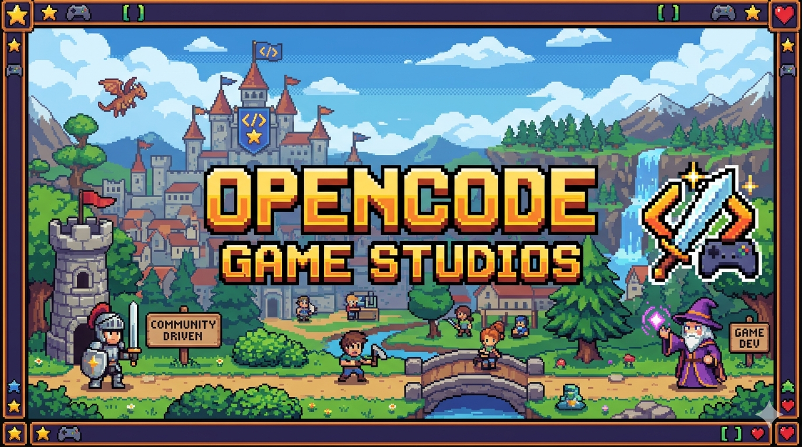

# OpenCode Game Studios

<p align="center">
  
</p>

> ⚡ Evolved from [Claude Code Game Studios (CCGS)](https://github.com/Donchitos/Claude-Code-Game-Studios) — now a standalone framework with workflow selection, phase gates, pre-workflow prototyping, and hybrid discovery-to-production pipelines.

[](LICENSE)
[](.opencode/agents/)
[](.opencode/skills/)
[](.opencode/commands/)
[](.opencode/plugins/)
[](tests/)
[](https://opencode.ai)

---

## 📑 Table of Contents

- [💡 Motivation](#-motivation)
- [📊 Port Status](#-port-status)
- [🚀 Quick Start](#-quick-start)
- [🔌 Recommended Plugins](#-recommended-plugins)
- [🗺️ Key Mappings](#️-key-mappings)
- [🧠 Model Mapping](#-model-mapping)
- [🎯 Model Assignment Strategy](#-model-assignment-strategy)
- [🔄 Customizing Models](#-customizing-models)
- [📁 Directory Tree](#-directory-tree)
- [🔗 Hooks Plugin](#-hooks-plugin)
- [🏗️ Studio Hierarchy](#️-studio-hierarchy)
- [🐛 Known Issues](#-known-issues)
- [📄 License](#-license)

---

## 💡 Motivation

Game development is a multi-disciplinary process — design, writing, architecture,
programming, art, audio, QA, release — that's hard to coordinate with AI assistants
in ad-hoc chat sessions. **OpenCode Game Studios** provides a structured framework
for the full game lifecycle:

- **Pre-workflow exploration** — Rapidly prototype 2-4 ideas with zero commitment
  before choosing a development workflow
- **Design-first pipeline** — Brainstorm → systems map → section-by-section GDDs →
  cross-GDD review, before any code is written
- **Phase gates** — Formal checkpoints between phases with PASS/CONCERNS/FAIL
  verdicts that prevent advancing with gaps
- **Workflow selection** — Choose Hybrid (lightweight discovery then production)
  or Full OCGS (process-heavy from day one), depending on team size and project
  maturity
- **49 coordinated agents** — From creative director to engine specialists, each
  with defined responsibilities, delegation maps, and strict domain boundaries
- **51 slash commands** — Route through the right skill every time, from
  `/brainstorm` to `/launch-checklist`

This project evolved from [CCGS](https://github.com/Donchitos/Claude-Code-Game-Studios)
and runs on [OpenCode](https://opencode.ai).

---

> ⚠️ **Active Development** — This is a living framework. Things will
> break, change, and improve. Report bugs at
> [github.com/striderZA/OpenCodeGameStudios/issues](https://github.com/striderZA/OpenCodeGameStudios/issues).

---

## 📊 Port Status

| Component | CCGS (Claude Code) | OpenCode | Status |
|-----------|-------------------|----------|--------|
| 🤖 **Agents** | 49 agents (`.claude/agents/`) | 49 agents (`.opencode/agents/`) | ✅ |
| ⌨️ **Skills** | 72 skills (`.claude/skills/`) | 76 skills (`.opencode/skills/`) | ✅ +4 |
| ⌨️ **Commands** | — | 51 commands (`.opencode/commands/`) | ✅ New |
| 🔗 **Plugins** | 12 bash hooks (`.claude/hooks/`) | 3 TS plugins (`.opencode/plugins/`) | ✅ **183 tests** |
| 📏 **Rules** | 11 rule files (`.claude/rules/`) | 11 rule files (`.opencode/rules/`) | ✅ |
| ⚙️ **Config** | `CLAUDE.md` + `.claude/settings.json` | `AGENTS.md` + `opencode.json` | ✅ |

---

## 🚀 Quick Start

```bash
opencode
```

Type `/` to browse all 76 skills and 51 commands, or `/start` for onboarding.

### 🎮 Demo Game

See [**OCGS-Pong**](https://github.com/striderZA/OCGS-Pong) — a complete Pong game built entirely with this toolchain. Demonstrates the full workflow from concept through implementation using OCGS agents and skills.

---

## 🧩 Modular Framework

The framework is partitioned into **19 pluggable theme modules**. Only install what you need for your project:

| Module | Description |
|--------|-------------|
| `core` | Framework skeleton — directors, onboarding, `/start`, `/help` (required) |
| `art` | Aseprite MCP, art bible, asset specs, art generation |
| `design` | Game mechanics, systems design, combat, balance, playtesting |
| `architecture` | Technical planning, ADRs, architecture review |
| `stories` | Epics, stories, dev workflow, code review |
| `programming` | Gameplay, AI, engine, network agents + coding rules |
| `ui` | UX design, UI programming, accessibility |
| `audio` | Audio direction, sound design |
| `narrative` | Story, world-building, dialogue |
| `level-design` | Level layout, encounter design |
| `qa` | Testing strategy, bug tracking, profiling, skill testing |
| `release` | Release management, sprints, changelogs, hotfixes |
| `prototyping` | Rapid prototyping, concept exploration |
| `live-ops` | Post-launch content, community management |
| `localization` | i18n, translation pipeline |
| `engine-godot` | Godot 4 specialists (GDScript, C#, shaders, GDExtension) |
| `engine-unity` | Unity specialists (DOTS, shaders, Addressables, UI) + unity-mcp |
| `engine-unreal` | Unreal Engine 5 specialists (GAS, Blueprint, replication, UMG) |
| `data` | Data file conventions and validation |

```bash
# Install modules
node .opencode/modules/install.mjs add core
node .opencode/modules/install.mjs add engine-godot art design qa

# List all available and installed modules
node .opencode/modules/install.mjs list

# See module details
node .opencode/modules/install.mjs info core

# Remove a module (preserves user-modified files)
node .opencode/modules/install.mjs remove art
```

Module sources live in `.opencode/modules/<name>/` and are copied into the
framework directories on install. User-modified files are detected during
removal and left in place.

---

## 🔌 Recommended Plugins

These plugins enhance the OpenCode experience and are recommended for
all game development sessions:

| Plugin | Purpose |
|--------|---------|
| [**dynamic-context-purging**](https://github.com/Opencode-DCP/opencode-dynamic-context-pruning)| Dynamic context pruning — automatically manages context window size, indexes content for search, and prevents context overflow during long sessions |
| [**Superpowers**](https://github.com/obra/superpowers) | Enhanced skill library — provides structured workflows for brainstorming, test-driven development, writing plans, code review, and parallel agent dispatch |

Add them to your `opencode.json`:

```json
{
  "plugin": [
    "./.opencode/plugins/ccgs-hooks.ts",
    "PLUGIN_NAME"
  ]
}
```

---

## 🗺️ Key Mappings

| CCGS (Claude Code) | OpenCode |
|--------------------|----------|
| `.claude/skills/*.md` → | `.opencode/skills/*.md` |
| `.claude/agents/*.md` → | `.opencode/agents/*.md` |
| `.claude/hooks/*.sh` → | `.opencode/plugins/ccgs-hooks.ts` |
| `.claude/rules/*.md` → | `.opencode/rules/*.md` |
| `CLAUDE.md` → | `AGENTS.md` |
| `.claude/settings.json` → | `opencode.json` |

---

## 🧠 Model Mapping

| CCGS | OpenCode |
|------|----------|
| `opus` 🐙 | `kimi-k2.6` |
| `sonnet` 🖋️ | `qwen3.6-plus` |
| `haiku` 🍃 | `deepseek-v4-flash` |

---

## 🎯 Model Assignment Strategy

| Tier | Model | Agents | Rationale |
|------|-------|--------|-----------|
| **Directors** (Tier 1) | `opencode-go/kimi-k2.6` | 3 (creative-director, technical-director, producer) | Heaviest model for strategic planning, architecture decisions, and cross-team coordination |
| **Workhorses** (Tier 2-3) | `opencode-go/qwen3.6-plus` | 43 (all other agents) | Balanced model for day-to-day design, implementation, testing, and review tasks |
| **Lightweight** (Special) | `opencode-go/deepseek-v4-flash` | 3 (community-manager, devops-engineer, sound-designer) | Fast, low-latency model for simple, repetitive, or always-running agents |

> **Note:** Subagents invoked via the `task` tool inherit the caller's model regardless of their frontmatter `model:` field. See [Known Issues](#known-issues).

The default session model (set via `opencode -m`) should match the tier of work:
- `opencode -m opencode-go/kimi-k2.6` — director-level sessions
- `opencode -m opencode-go/qwen3.6-plus` — general development sessions
- `opencode -m opencode-go/deepseek-v4-flash` — quick QA or maintenance sessions

---

## 🔄 Customizing Models

OpenCode supports **any model provider** — switch the studio to your preferred
models, including local ones, with a single command.

### Quick switch

```bash
# Preview the change first
node utils/assign-models.js --dry-run --map '{
  "opencode-go/kimi-k2.6":         "anthropic/claude-opus-4",
  "opencode-go/qwen3.6-plus":      "openai/gpt-4o",
  "opencode-go/deepseek-v4-flash": "ollama/llama3.2"
}'

# Apply it
node utils/assign-models.js --map '{
  "opencode-go/kimi-k2.6":         "anthropic/claude-opus-4",
  "opencode-go/qwen3.6-plus":      "openai/gpt-4o",
  "opencode-go/deepseek-v4-flash": "ollama/llama3.2"
}'
```

Or save your mapping to a JSON file and refer to it:

```bash
node utils/assign-models.js --config my-models.json
```

### Provider examples

| Provider | Model ID Format | Example |
|----------|----------------|---------|
| **OpenCode** (default) | `opencode-go/<model>` | `opencode-go/qwen3.6-plus` |
| **Anthropic Claude** | `anthropic/<model>` | `anthropic/claude-opus-4`, `anthropic/claude-sonnet-4` |
| **OpenAI** | `openai/<model>` | `openai/gpt-4o`, `openai/o3` |
| **Google Gemini** | `google/<model>` | `google/gemini-2.5-pro` |
| **Ollama** (local) | `ollama/<model>` | `ollama/llama3.2`, `ollama/mistral` |
| **OpenAI-compatible** | `<endpoint>/<model>` | `http://localhost:11434/v1/llama3.2` |

> **Tip:** Run `opencode models` to list all models available through your
> configured providers. See the [OpenCode provider docs](https://opencode.ai)
> for setup instructions.

---

## 📁 Directory Tree

```
/
├── AGENTS.md                  📋 Project configuration
├── opencode.json              ⚙️ OpenCode config (permissions, plugins)
├── .opencode/
│   ├── commands/              ⌨️ 51 slash commands (routes to skills)
│   ├── agents/                🤖 49 agent definitions
│   ├── skills/                🛠️ 76 skill workflows
│   ├── plugins/
│   │   ├── ccgs-hooks.ts      🔗 Session lifecycle, validation
│   │   ├── drift-detector.ts  🔍 Template drift detection
│   │   ├── changelog-generator.ts 📝 Changelog generation
│   │   └── tests/             🧪 11 test suites (140 tests)
│   ├── rules/                 📏 11 coding standards
│   └── modules/               🧩 19 pluggable theme modules
│       ├── install.mjs        CLI: add/remove/list modules
│       ├── installed.json     Module manifest
│       ├── core/              Core module (always installed)
│       ├── art/               Art module (aseprite MCP, art bible)
│       └── ...                19 modules total
├── design/                    🎨 Game design documents
├── docs/
│   ├── CONTRIBUTING.md        📖 Framework contribution guide
│   ├── authoring-agents.md    🤖 Agent authoring guide
│   ├── authoring-skills.md    🛠️ Skill authoring guide
│   ├── architecture/          🏗️ ADRs
│   └── engine-reference/      📚 Engine API reference
├── tests/
│   ├── agents/                🔍 Agent framework validation
│   ├── workflow/              🔄 Workflow integrity (refs, paths, gates, invariants)
│   ├── [game-specific tests]
│   └── [spawned by test-setup]
├── production/                📊 Sprint plans, session logs
├── utils/                     🔧 Developer utilities
│   └── assign-models.js       🎯 Batch-model assignment tool
└── ...                        🎮 Game source & assets
```

---

## 🔌 Plugin Architecture

The OCGS plugin system is documented in `.opencode/plugins/README.md`.
Three TypeScript plugins implement the original 12 CCGS bash hooks plus
extensions:

| Plugin | Purpose |
|--------|---------|
| **`ccgs-hooks.ts`** | Session lifecycle, commit validation, asset checks, agent logging, gap detection |
| **`drift-detector.ts`** | Detects agent/skill/command template drift on session start and file writes |
| **`changelog-generator.ts`** | Generates CHANGELOG.md from conventional commits since last tag |

### Hooks Mapping

All 12 bash hooks from CCGS ported to `ccgs-hooks.ts`:

| # | Bash Hook | 🔌 OpenCode Event | 🧪 Tests |
|---|-----------|-------------------|:--------:|
| 1 | `session-start.sh` | `session.created` | **18** |
| 2 | `session-stop.sh` | `session.idle` / `server.instance.disposed` | **10** |
| 3 | `detect-gaps.sh` | `session.created` | **15** |
| 4 | `log-agent.sh` | `tool.execute.before` (task) | **5** |
| 5 | `log-agent-stop.sh` | `tool.execute.after` (task) | **4** |
| 6 | `validate-assets.sh` | `tool.execute.after` | **16** |
| 7 | `validate-commit.sh` | `tool.execute.before` (git commit) | **17** |
| 8 | `validate-push.sh` | `tool.execute.before` (git push) | **13** |
| 9 | `validate-skill-change.sh` | `tool.execute.after` | **12** |
| 10 | `pre-compact.sh` | `experimental.session.compacting` | **14** |
| 11 | `post-compact.sh` | `experimental.compaction.autocontinue` | **5** |
| 12 | `notify.sh` | Utility (`showNotification`) | — |

> 🧪 Run plugin test suite: `node .opencode/plugins/tests/test-<name>.mjs`
> 🧪 Run workflow integrity suite: `node tests/workflow/run-all.mjs`

### Contributing to the Framework

See [CONTRIBUTING.md](docs/CONTRIBUTING.md) for guides on adding agents,
skills, commands, rules, and plugins.

---

## 🏗️ Studio Hierarchy

```text
🎬  creative-director    🔧  technical-director    🎯  producer
├── 🎨  art-director        ├── 💻  lead-programmer
├── 🎵  audio-director      ├── 🧪  qa-lead
├── 📖  narrative-director  ├── 📦  release-manager
├── 🎮  game-designer       └── 🌍  localization-lead
└── ... (49 agents total)
```

---

## 🐛 Known Issues

| Issue | Impact | Workaround |
|-------|--------|------------|
| **Subagent model resolution via `task`** — Agent `model:` frontmatter fails with `ProviderModelNotFoundError` for models that work when used directly via `opencode -m <model>`. Subagents inherit the caller's model per OpenCode docs, so the frontmatter model may only apply when the agent runs as a primary session. | Agents using `opencode-go/kimi-k2.6` and `opencode-go/deepseek-v4-flash` as subagents via `task` | Use `opencode-go/qwen3.6-plus` for subagent-heavy workflows, or start dedicated sessions with `opencode -m <model>` for director-level agents. Root cause being tracked upstream in OpenCode. |

---

## 📄 License

[MIT](LICENSE) — Free for any use.

---

<p align="center">
  <sub>Built with ❤️ for AI-assisted game development</sub>
  <br>
  <sub>OpenCode Game Studios · CCGS Port</sub>
  <br>
  <sub>MIT License · Free for any use</sub>
  <br><br>
  <a href="https://paypal.me/striderZA">☕ Support development</a>
</p>
