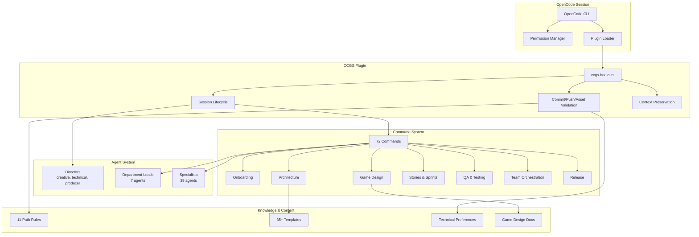

# Architecture Overview: OpenCode Game Studios (CCGS Port)

## Overview

This project is an OpenCode port of [Claude Code Game Studios](https://github.com/Donchitos/Claude-Code-Game-Studios) — a structured game development framework that turns an AI coding session into a coordinated virtual studio. The port translates CCGS's 49 agents, 72 slash commands, 12 bash hooks, 11 rules, and 35+ document templates from Claude Code's `.claude/` format into OpenCode's `.opencode/` plugin architecture.

**Project**: The 19th Hole (cozy golf course management)  
**Engine**: Godot 4.6.2  
**Language**: GDScript  

## Technology Stack

| Layer | Technology |
|-------|-----------|
| Engine | Godot 4.6.2 |
| Scripting | GDScript |
| AI Platform | OpenCode (plugin API v1.14.28) |
| Plugin Runtime | TypeScript, executed via OpenCode's plugin sandbox |
| Knowledge Graph | GitNexus (`.gitnexus/`) |
| Auth/Config | Zod schema validation, YAML config files |
| Build | SCons (engine), Godot Export Templates |

## Directory Architecture

```
/
├── .opencode/                    # OpenCode configuration & plugins
│   ├── agents/                   # 49 agent definitions (markdown + YAML frontmatter)
│   ├── commands/                 # 72 slash commands (markdown)
│   ├── docs/                     # Ported documentation
│   │   ├── templates/            # 35+ document templates
│   │   │   └── collaborative-protocols/  # 3 agent collaboration protocols
│   │   └── technical-preferences.md      # Engine/project config
│   ├── plugins/                  # TypeScript plugin (12 hooks consolidated)
│   │   └── ccgs-hooks.ts         # CCGS hooks as OpenCode plugin
│   ├── rules/                    # 11 path-scoped coding standards
│   ├── package.json              # @opencode-ai/plugin dependency
│   └── node_modules/             # Plugin dependencies
├── src/                          # Game source code
├── assets/                       # Game assets
├── design/                       # Game design documents
│   └── gdd/                      # Game Design Documents (GDDs)
├── docs/                         # Technical documentation
│   ├── architecture/             # ADRs & architecture registry
│   ├── engine-reference/         # Version-pinned API references
│   ├── examples/                 # Session pipeline examples
│   ├── registry/                 # Architecture decision registry
│   └── WORKFLOW-GUIDE.md         # Full development workflow reference
├── tests/                        # Test suites
├── tools/                        # Build & pipeline tools
├── prototypes/                   # Throwaway prototypes
├── production/                   # Sprint/milestone/release tracking
├── AGENTS.md                     # Master configuration
├── opencode.json                 # OpenCode permissions & plugin config
└── README.md                     # Project overview
```

## Component Architecture

### 1. Plugin System (ccgs-hooks.ts)

The central runtime component. Exports a single `CCGSHooks` plugin that hooks into 5 OpenCode lifecycle events:

```
                          ┌─────────────────────┐
                          │   OpenCode Session   │
                          └──────┬──────────┬────┘
                                 │          │
                    ┌────────────┤          ├──────────────┐
                    │            │          │              │
              session.created   idle      compacting     tool.execute
                    │            │          │              │
                    ▼            ▼          ▼              ▼
              ┌─────────┐ ┌─────────┐ ┌─────────┐ ┌─────────────────┐
              │Session  │ │Session  │ │Context  │ │ Pre/Post Tool   │
              │Startup  │ │Shutdown │ │Preserve │ │ Validation      │
              │(branch, │ │(archive │ │(state,  │ │(commit, push,   │
              │commits, │ │ state,  │ │ WIP     │ │ asset, skill    │
              │bugs,    │ │ git     │ │ markers)│ │ change checks)  │
              │session  │ │ activity│ │         │ │                 │
              │state)   │ │ )       │ │         │ │                 │
              └─────────┘ └─────────┘ └─────────┘ └─────────────────┘
```

**Hooks implemented:**
- `event(session.created)` — prints branch, recent commits, sprint/milestone/bug status, session state summary
- `event(session.idle / server.instance.disposed)` — archives state file, logs git activity
- `experimental.session.compacting` — preserves session state and WIP markers before context compression
- `tool.execute.before` — validates git push to protected branches, validates commit content (design sections, JSON validity, hardcoded values, TODO format)
- `tool.execute.after` — validates asset naming/JSON, advises skill testing after command edits

### 2. Command System (72 commands)

All commands live in `.opencode/commands/` as markdown files with YAML frontmatter. Each command maps to one `/command-name` invocation.

**Command categories:**

| Category | Count | Examples |
|----------|-------|---------|
| Team orchestration | 9 | `/team-combat`, `/team-narrative`, `/team-ui`, `/team-audio` |
| Story & sprints | 8 | `/create-epics`, `/create-stories`, `/dev-story`, `/sprint-plan` |
| Quality & testing | 7 | `/qa-plan`, `/smoke-check`, `/regression-suite`, `/test-setup` |
| Game design | 6 | `/brainstorm`, `/design-system`, `/quick-design`, `/map-systems` |
| Architecture | 5 | `/create-architecture`, `/architecture-decision`, `/architecture-review` |
| Reviews | 5 | `/design-review`, `/code-review`, `/balance-check`, `/gate-check` |
| Art & assets | 4 | `/art-bible`, `/asset-spec`, `/asset-audit` |
| UX & interface | 3 | `/ux-design`, `/ux-review` |
| Release | 4 | `/release-checklist`, `/changelog`, `/patch-notes`, `/hotfix` |
| Onboarding | 4 | `/start`, `/help`, `/setup-engine`, `/project-stage-detect` |
| Production | 4 | `/milestone-review`, `/retrospective`, `/bug-report`, `/bug-triage` |
| Prototyping | 2 | `/prototype`, `/reverse-document` |
| Skills | 2 | `/skill-test`, `/skill-improve` |
| Other | 11 | `/estimate`, `/scope-check`, `/content-audit`, `/tech-debt`, etc. |

### 3. Agent Hierarchy (49 agents)

Agents are organized in a 3-tier hierarchy matching real game studio structure:

```
Tier 1 — Directors (primary mode, 3 agents)
├── creative-director    — Vision, tone, creative conflict resolution
├── technical-director   — Code architecture, technical risk
└── producer             — Sprint/milestone/scope management

Tier 2 — Department Leads (subagent mode, 7 agents)
├── game-designer        — Mechanics, systems, core loop design
├── lead-programmer      — Code quality, API design, feasibility
├── art-director          — Visual identity, art pipeline
├── audio-director       — Sonic identity, audio systems
├── narrative-director   — Story architecture, character arcs
├── qa-lead              — Test strategy, quality gates
└── release-manager      — Release pipeline, certification

Tier 3 — Specialists (subagent mode, 39 agents)
├── Godot specialists    — godot-specialist, godot-gdscript, godot-shader, 
│                          godot-csharp, godot-gdextension
├── Unity specialists    — unity-specialist, unity-dots, unity-shader,
│                          unity-addressables, unity-ui
├── Unreal specialists   — unreal-specialist, ue-blueprint, ue-gas,
│                          ue-replication, ue-umg
├── Programmers          — gameplay, engine, ai, network, tools, ui
├── Designers            — systems, level, economy, ux, prototyper
├── Content              — writer, world-builder, sound-designer
├── QA                   — qa-tester
├── Infrastructure       — devops-engineer, security-engineer, performance-analyst,
│                          analytics-engineer, technical-artist
├── Operations           — localization-lead, accessibility-specialist,
│                          live-ops-designer, community-manager
```

**Agent configuration format** (YAML frontmatter in markdown):
- `description` — purpose and when to invoke
- `mode` — `primary` (director/producer) or `subagent`
- `model` — LLM model assignment (e.g., `kimi-k2.6`, `qwen3.6-plus`)
- `maxTurns` — conversation turn limit
- `permission` — tool access restrictions

### 4. Rules Engine (11 path-scoped rules)

Rules in `.opencode/rules/` are automatically evaluated when editing files matching their path patterns:

```
src/gameplay/**    — Data-driven values, delta time usage, no UI refs
src/core/**        — Zero alloc hot paths, thread safety, API stability
src/ai/**          — Performance budgets, debuggability, data-driven params
src/networking/**  — Server-authoritative, versioned messages, security
src/ui/**          — No game state ownership, l10n-ready, accessibility
design/gdd/**      — Required 8 sections, formula format, edge cases
tests/**           — Test naming, coverage reqs, fixture patterns
prototypes/**      — Relaxed standards, README required
shader-code        — GPU perf, branch elimination, uniform buffers
data-files         — JSON schema validation, value ranges
narrative          — Lore consistency, character voice
```

### 5. Template Library (35+ templates)

`.opencode/docs/templates/` contains structured document templates organized into:

| Category | Templates |
|----------|-----------|
| Game Design | game-concept, game-design-document, game-pillars, systems-index, difficulty-curve, economy-model, faction-design, level-design-document, player-journey |
| Architecture | architecture-decision-record, architecture-doc-from-code, architecture-traceability, technical-design-document |
| UI/UX | ux-spec, hud-design, interaction-pattern-library |
| Art/Audio | art-bible, sound-bible |
| QA/Testing | test-plan, test-evidence, test-plan, skill-test-spec |
| Project Management | sprint-plan, milestone-definition, project-stage-report, post-mortem, risk-register-entry |
| Release | release-checklist-template, release-notes, changelog-template, patch-notes |
| Content | narrative-character-sheet, concept-doc-from-prototype, design-doc-from-implementation, pitch-document, incident-response |
| Collaboration | collaborative-protocols/design-agent, implementation-agent, leadership-agent |
| Accessibility | accessibility-requirements |

### 6. Configuration & Permissions

`opencode.json` defines:
- **Plugin registration**: `./.opencode/plugins/ccgs-hooks.ts`
- **Bash permissions**: 10 allowed patterns (`git status*`, `git diff*`, `pytest*`, etc.) and 10 denied patterns (`rm -rf *`, `git push --force*`, `sudo *`, `*.env*`, etc.)
- **Read permissions**: `.env*` files denied

## Key Execution Flows

### Session Lifecycle

```
Session Start
  │
  ├── Plugin loads (ccgs-hooks.ts)
  │   └── handleSessionCreated()
  │       ├── Print project root & branch
  │       ├── Show last 5 commits
  │       ├── Detect active sprint & milestone
  │       ├── Count open bugs & code health (TODOs/FIXMEs)
  │       └── Preview session-state/active.md if exists
  │
  ├── Session Active
  │   ├── User invokes /command-name
  │   │   └── Command markdown file executes
  │   │       ├── Pre-execution: tool.execute.before validates
  │   │       └── Post-execution: tool.execute.after validates
  │   │
  │   ├── File writes go through rule validation
  │   │   └── Path-matching rules applied automatically
  │   │
  │   └── State updates written to production/session-state/active.md
  │
  ├── Context Compaction
  │   └── experimental.session.compacting
  │       ├── Preserve active state and WIP markers
  │       └── Add recovery instructions
  │
  └── Session End
      └── handleSessionIdle()
          ├── Archive session state to production/session-logs/
          └── Log recent commits and uncommitted changes
```

### Validation Pipeline

```
User Action                         Validation (tool.execute.before/after)
│
├── git commit ───────────────────► Validate staged files:
│   │                                 ├── GDDs: check 8 required sections
│   │                                 ├── JSON: validate format
│   │                                 ├── src/gameplay/: warn on hardcoded values
│   │                                 └── src/*: warn on untagged TODOs/FIXMEs
│
├── git push ─────────────────────► Warn on protected branch (main/master/develop)
│
├── Write to assets/ ─────────────►
│   ├── Naming: must be lowercase_underscore
│   └── JSON: validate format (blocking)
│
└── Write to commands/ ───────────► Advise running /skill-test
```

## Mermaid Architecture Diagram



## Cross-References

| Aspect | Primary File | Related |
|--------|-------------|---------|
| Agent definitions | `.opencode/agents/` (49 files) | `AGENTS.md` |
| Commands | `.opencode/commands/` (72 files) | `docs/WORKFLOW-GUIDE.md` |
| Plugin/hooks | `.opencode/plugins/ccgs-hooks.ts` | `opencode.json` |
| Path rules | `.opencode/rules/` (11 files) | `AGENTS.md` coding standards |
| Templates | `.opencode/docs/templates/` (35 files) | Individual command docs |
| Engine config | `.opencode/docs/technical-preferences.md` | `design/gdd/game-concept.md` |
| Permission config | `opencode.json` | `AGENTS.md` |
| ADRs | `docs/architecture/` | `docs/registry/architecture.yaml` |
| Engine refs | `docs/engine-reference/` | Engine-specific agent prompts |

## Design Decisions

1. **Plugin consolidation**: 12 bash hooks consolidated into 1 TypeScript plugin. Hooks that were `exit early if not relevant` bash scripts became conditional guards in `tool.execute.before` / `tool.execute.after`.

2. **Command format**: Claude Code skills used `SKILL.md` files in subdirectories. OpenCode commands are flat `.md` files in `.opencode/commands/` with YAML frontmatter. The `description` field enables OpenCode's slash-command autocomplete.

3. **Agent format**: Claude Code agent definitions became OpenCode-compatible markdown with YAML frontmatter supporting `mode`, `model`, and `maxTurns` fields.

4. **Rules port**: 11 Claude Code rules became path-scoped `.md` files in `.opencode/rules/`, preserving the same path-globbing semantics.

5. **No session tracking in plugin**: The `notify.sh` hook (Windows toast notifications) was not ported, as OpenCode's plugin API does not expose desktop notification channels.
